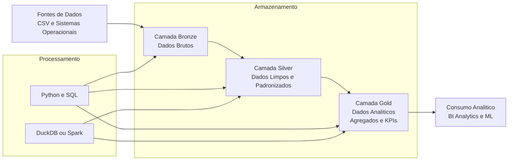

# 📊 P01 — Data Lake: Bronze → Silver → Gold

## 📌 Visão Geral

Este projeto demonstra a implementação de uma **arquitetura de Data Lake** com as camadas **Bronze, Silver e Gold**, seguindo o padrão Medallion Architecture amplamente utilizado em engenharia de dados corporativos. 

A arquitetura garante que os dados sejam capturados em seu estado bruto (Bronze), transformados para maior qualidade e consistência (Silver), e organizados para consumo analítico e geração de valor para negócios (Gold). 

---

## 🎯 Objetivo

Fornecer um pipeline de dados estruturado para ingestão, tratamento e organização de dados, permitindo:

* **Ingestão automatizada e confiável** de dados brutos
* **Qualidade e padronização** por meio de transformações
* **Datasets prontos para análise** ou consumo por ferramentas de BI e ML

---

## 🏗️ Arquitetura e Fluxo de Dados



### 🟤 Bronze (Raw)

> “Na camada Bronze eu preservo os dados exatamente como chegam, sem transformação, garantindo rastreabilidade, auditoria e possibilidade de reprocessamento.”

* Dados são coletados em seu formato original, sem transformações.
* Objetivo: preservar o estado bruto para auditoria e reprocessamento.

### ⚪ Silver (Cleansed / Enriched)

> “Na Silver eu aplico limpeza, padronização de tipos, regras de qualidade e enriquecimentos, criando uma base confiável para análises.”

* Dados limpos, padronizados e enriquecidos.
* Transformações aplicadas para remover duplicações e ajustar formatos.

### 🟡 Gold (Analytics-Ready)

> “Na Gold eu organizo os dados para consumo, com agregações, KPIs e estruturas analíticas prontas para BI, analytics ou modelos de ML.”

* Dados organizados para análises específicas (ex.: tabelas modelo estrela, agregados temáticos).
* Prontos para consumo por ferramentas como Power BI ou pipelines de ML.

> “O processamento é feito com Python e SQL, utilizando DuckDB ou Spark conforme a necessidade de escala e performance.”

O padrão Medallion facilita a manutenção incremental do pipeline e garante clareza entre os diferentes níveis de qualidade de dados. 

> *Nota:* seguir essa arquitetura permite separar claramente cada estágio de refinamento dos dados, promovendo rastreabilidade e confiabilidade.

---

## 🛠️ Tecnologias e Ferramentas

**Linguagens:**

* Python
* SQL

**Engenharia de Dados:**

* Pipelines de ingestão e transformação
* Medallion Architecture (Bronze → Silver → Gold)

**Infraestrutura:**

* AWS S3 (ou S3-compatível)
* DuckDB como motor analítico leve

**Automação & Deploy:**

* GitHub Actions (CI/CD)
* Docker (opcional para ambientes locais)

---

## ▶️ Como Executar o Projeto

1. **Clonar o repositório**

   ```bash
   git clone https://github.com/roberto-ssoares/Data-Engineering.git
   ```

2. **Acessar o diretório do projeto**

   ```bash
   cd Data-Engineering/Data-Lake/P01-Bronze-Silver-Gold
   ```

3. **Criar ambiente Python**

   ```bash
   python -m venv venv
   source venv/bin/activate
   pip install -r requirements.txt
   ```

4. **Executar scripts de ingestão e transformação**

   * Pipeline Bronze
   * Pipeline Silver
   * Pipeline Gold
     *(Adapte conforme sua estrutura de scripts)*

---

## 📈 Resultados e Benefícios

* **Pipeline modular e escalável** com camadas de dados bem definidas
* **Facilidade de reprocessamento** em caso de falhas ou novas regras
* **Dados refinados prontos para BI/ML**
* **Possibilidade de extender a automação com orquestradores** como Airflow ou Prefect

---

## 📂 Estrutura de Pastas

```text
P01-Bronze-Silver-Gold/
├── bronze/             # Scripts e dados brutos
├── silver/             # Scripts de limpeza e transformação
├── gold/               # Scripts para geração de dados consumíveis
├── configs/            # Arquivos de configuração
├── notebooks/          # Notebooks de exploração
├── requirements.txt    # Dependências do projeto
└── README.md           # Este arquivo
```

---

## 🧪 Exemplos de Uso

Você pode integrar esse pipeline a:

* Dashboards em **Power BI** ou **Tableau**
* Sistemas de ingestão contínua
* Data products e APIs analíticas

> O padrão adotado aqui pode ser adaptado para pipelines batch ou event-driven.

---

## 🚀 Possíveis Evoluções

* Adicionar **orquestração de tarefas** com Airflow ou Prefect
* Suportar **processamento incremental** e detecção de mudanças
* Integração com catálogos de dados e testes automáticos de qualidade
* Exposição de métricas e logs via Grafana ou outro dashboard

---

## 📫 Contribuição e Feedback

Se você encontrar melhorias ou tiver sugestões, sinta-se à vontade para abrir um *issue* ou *pull request*!

