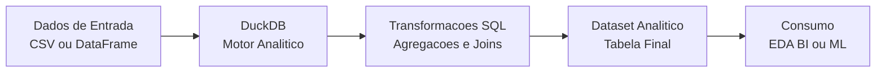

Perfeito. Então agora vamos **alinhar o README do DuckDB exatamente ao que você tem (ou vai ter) no projeto**, sem exagero, sem “fake enterprise”, mas **100% defensável em entrevista**.

Vou te entregar:

1️⃣ **README AJUSTADO** para o projeto recém-criado  
2️⃣ Comentários rápidos do **porquê cada parte existe**  
3️⃣ Checklist final para subir no GitHub

Você pode **copiar e colar direto** no `DuckDB-Analytics-Pipeline/README.md`.

---

# 🦆 DuckDB Analytics Pipeline

## 📌 Visão Geral

Este projeto demonstra a construção de um **pipeline analítico simples e eficiente utilizando DuckDB**, com foco em **Analytics Engineering** e **engenharia de dados para workloads analíticos**.

A proposta é mostrar como o DuckDB pode ser utilizado como um **motor SQL analítico embutido**, ideal para transformação de dados, exploração analítica e preparação de datasets, sem necessidade de infraestrutura distribuída.

---

## 🎯 Objetivo do Projeto

O objetivo deste projeto é:

- Construir um **pipeline analítico reprodutível**

- Demonstrar o uso de **DuckDB + SQL** para transformação de dados

- Preparar datasets prontos para **análise, BI ou ML**

- Evidenciar boas práticas de **organização e documentação de pipelines**

---

## 🏗️ Arquitetura e Fluxo de Dados



### 🔎 Descrição do Fluxo

1. Os dados são carregados a partir de arquivos ou DataFrames

2. O DuckDB executa transformações SQL

3. Os dados são materializados em tabelas analíticas

4. O dataset final fica pronto para consumo

---

## 🛠️ Tecnologias Utilizadas

- **Python**

- **DuckDB**

- **SQL Analítico**

- **pandas**

- **Git & GitHub**

---

## ▶️ Como Executar o Projeto

### 1️⃣ Clonar o repositório

```bash
git clone https://github.com/roberto-ssoares/Data-Engineering.git
cd Data-Engineering/DuckDB-Analytics-Pipeline
```

### 2️⃣ Criar ambiente virtual

```bash
python -m venv venv
source venv/binactivate   # Windows: venv\Scripts\activate
pip install -r requirements.txt
```

### 3️⃣ Executar o pipeline

```bash
python src/pipeline.py
```

O script executa:

- Criação da base DuckDB

- Registro dos dados de entrada

- Execução das transformações SQL

- Geração da tabela analítica final

---

## 📂 Estrutura de Pastas

```text
DuckDB-Analytics-Pipeline/
├── data/
│   └── raw/               # Dados de entrada
├── src/
│   └── pipeline.py        # Script principal do pipeline
├── requirements.txt
└── README.md
```

---

## 📈 Resultados Esperados

- Pipeline simples, claro e reprodutível

- Transformações analíticas via SQL

- Dataset final pronto para exploração ou consumo

- Baixa complexidade operacional

---

## 🧠 Quando Utilizar DuckDB

DuckDB é uma excelente escolha quando:

- O volume de dados é **pequeno a médio**

- O foco está em **análises e transformações**

- Busca-se **simplicidade e performance**

- Não há necessidade de concorrência transacional

> Em cenários de maior escala, este pipeline pode evoluir para Spark ou engines distribuídas.

---

## 🚀 Possíveis Evoluções

- Leitura direta de arquivos Parquet

- Processamento incremental

- Separação de camadas (staging / analytics)

- Integração com Data Lake (S3 / MinIO)

- Orquestração com Airflow ou Prefect

---

## 📌 Considerações Finais

Este projeto reforça o uso do DuckDB como uma **ferramenta moderna de Analytics Engineering**, complementando arquiteturas de Data Lake e pipelines de dados mais complexos.
