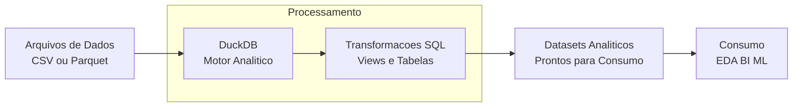

# 🦆 Pipeline Analítico com DuckDB

## 📌 Visão Geral

Este projeto demonstra a construção de um **pipeline analítico utilizando DuckDB** como motor de processamento SQL embutido, focado em **engenharia analítica**, eficiência de consultas e simplicidade operacional.

A proposta é mostrar como o DuckDB pode ser utilizado como alternativa leve a bancos analíticos tradicionais, permitindo **processamento local ou embarcado**, sem dependência de infraestrutura pesada, mantendo alta performance para workloads analíticos.

---

## 🎯 Objetivo do Projeto

Construir um pipeline de dados capaz de:

* Processar e transformar dados estruturados utilizando **SQL analítico**
* Servir como camada intermediária entre **Data Lake (arquivos)** e **consumo analítico**
* Demonstrar boas práticas de **Analytics Engineering**
* Simplificar pipelines analíticos em cenários de pequeno e médio porte

---

## 🏗️ Arquitetura e Fluxo de Dados



### 🔎 Descrição do Fluxo

* **Fonte de dados**: arquivos CSV ou Parquet
* **Processamento**: DuckDB executando SQL analítico
* **Transformações**: limpeza, padronização, joins e agregações
* **Saída**: datasets prontos para análise, BI ou modelagem

---

## 🛠️ Tecnologias Utilizadas

* **Linguagens**

  * Python
  * SQL

* **Motor Analítico**

  * DuckDB

* **Engenharia de Dados**

  * Pipelines analíticos
  * Transformações SQL
  * Views e tabelas analíticas

* **Ferramentas**

  * Git & GitHub
  * VS Code
  * Jupyter Notebook (quando aplicável)

---

## ▶️ Como Executar o Projeto

### 1️⃣ Clonar o repositório

```bash
git clone https://github.com/roberto-ssoares/DuckDB-Pipeline.git
cd DuckDB-Pipeline
```

### 2️⃣ Criar ambiente Python

```bash
python -m venv venv
source venv/bin/activate
pip install -r requirements.txt
```

### 3️⃣ Executar o pipeline

```bash
python run_pipeline.py
```

> O script realiza a leitura dos arquivos, executa as transformações SQL no DuckDB e gera as tabelas analíticas.

---

## 📂 Estrutura de Pastas

```text
duckdb-pipeline/
├── data/
│   ├── raw/              # Dados de entrada (CSV / Parquet)
│   ├── processed/        # Dados processados
│   └── analytics/        # Saídas analíticas
├── sql/
│   ├── staging.sql       # Transformações iniciais
│   ├── analytics.sql     # Queries analíticas
├── src/
│   └── pipeline.py       # Orquestração do pipeline
├── requirements.txt
└── README.md
```

---

## 📈 Resultados e Benefícios

* Execução de **consultas analíticas de alta performance**
* Redução de complexidade operacional (sem servidor dedicado)
* Facilidade de versionamento de transformações SQL
* Ideal para:

  * EDA
  * Analytics Engineering
  * Prototipação de pipelines
  * Casos locais ou edge analytics

---

## 🧠 Quando Usar DuckDB

DuckDB é especialmente indicado quando:

* O volume de dados cabe em disco local ou storage acessível
* O foco é **análise e transformação**, não concorrência transacional
* Busca-se **simplicidade + performance**
* Não há necessidade imediata de cluster distribuído

> Em cenários de maior escala, este pipeline pode ser evoluído para Spark ou engines distribuídas.

---

## 🚀 Possíveis Evoluções

* Integração com Data Lake (S3 / MinIO)
* Processamento incremental por partição (ex: ingest_date)
* Orquestração com Airflow ou Prefect
* Testes de qualidade de dados
* Materialização de métricas e KPIs

---

## 📫 Considerações Finais

Este projeto reforça o uso do DuckDB como **componente estratégico em pipelines analíticos**, mostrando que é possível unir **engenharia, SQL e simplicidade** em soluções eficientes e modernas.

